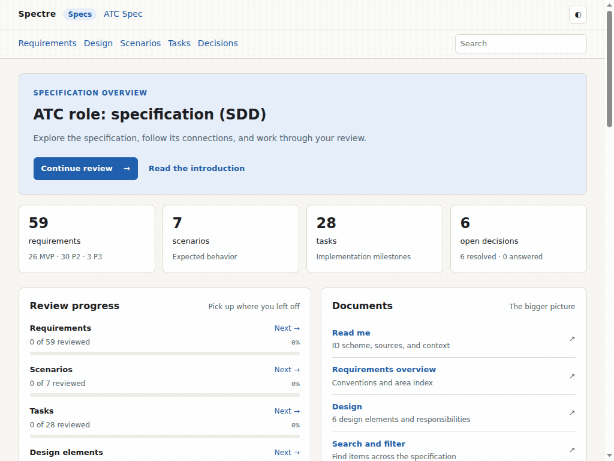
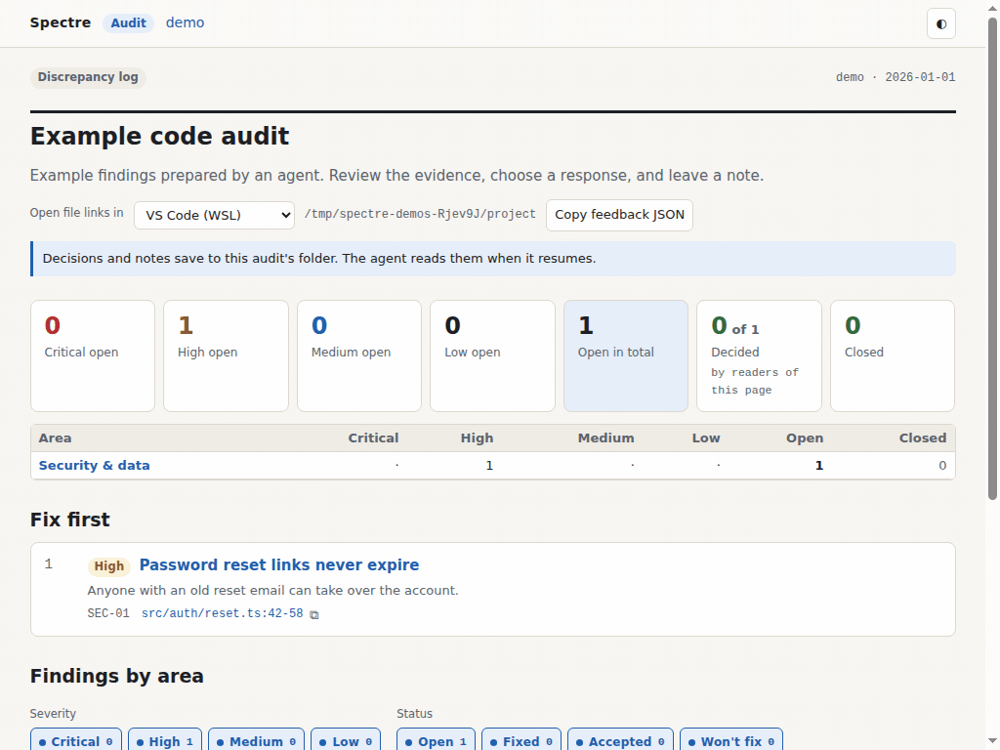

# Spectre

Spectre lets a coding agent present specs and code audits for your review.
Your agent prepares the content, starts the tool, and gives you a browser URL.
You leave feedback in the page; the agent reads it before continuing.

- **Spec mode** shows requirements, design, scenarios, tasks, and open decisions
  from a Markdown folder.
- **Audit mode** shows verified findings, evidence, and proposed responses,
  with saved progress across sessions.

## See it in use

These recordings use the bundled examples. The agent has already prepared the
content and started each viewer.

**Spec review:** search for a requirement, request a change, and save a note.
The agent can then read the feedback from the spec's `review/` folder.



[Still image](docs/demos/spec-review.png)

**Audit review:** inspect the evidence and response options, choose a response,
and save a note. The agent retrieves those decisions with `spectre audit resume`.



[Still image](docs/demos/audit-review.png)

## Get started

Build with Go 1.26.6 or newer and [Task](https://taskfile.dev):

```sh
task build
```

Put `bin/spectre` on your agent's PATH, or give it the executable's absolute
path. Spectre runs as one Go binary.

[SKILL.md](SKILL.md) tells the agent how to use both modes. For example:

> Read `/path/to/spectre/SKILL.md`. Audit this project and present the findings
> for my review. Read my feedback when I ask you to continue.

Once the content is ready, the viewer commands are:

```sh
spectre spec -dir /path/to/spec -port 0
spectre audit view --project /path/to/project
```

Both print a local URL. Keep the command running during the review.
Port `0` selects an available port; spec mode otherwise defaults to `8765`.
`spectre -dir ...` is shorthand for `spectre spec -dir ...`.

For a new audit, the agent first runs
`spectre audit init --project /path/to/project`, then writes the findings.
Initialization creates an empty report.

You can also register the bundled audit-only skill:

```sh
spectre audit setup --agent codex
```

## Feedback

Spec feedback goes into `<spec>/review/` as Markdown. Audit decisions and
notes go into the audit folder; the agent retrieves them with
`spectre audit resume --project /path/to/project`.

Tell the agent when you want it to read the feedback and continue. Local
saves do not send chat messages. For an audit opened as a standalone HTML file,
use **Copy feedback JSON** to return feedback to the agent.

## Reference

- [Agent workflow](SKILL.md)
- [Spec format, IDs, pages, and review files](docs/spec-format.md)
- [Audit workflow and recovery](docs/audit/resuming-audits.md)
- [Audit checklist](docs/audit/checklist.md)
- [Audit commands and setup](docs/audit/commands.md)
- [Instructions for agents editing Spectre](AGENTS.md)

## Development

`task verify` builds and runs the Go checks. The [Taskfile](Taskfile.yml)
also has formatting, browser-check, and benchmark tasks. Browser checks use
Linux Chromium and Node 22 as a test driver; the Spectre executable does not need Node.

```sh
task run                              # bundled spec example
task run:audit                        # bundled audit example
task run DIR=/path/to/spec             # your spec
task run:audit PROJECT=/path/to/project # your initialized audit
```

Each run prints its URL and chooses an available port. Add `PORT=8765` for a
fixed port. Demo feedback stays in `bin/demo` and survives restarts.
Use separate terminals for both viewers, and Ctrl+C to stop them.

To regenerate the recordings, install Linux Chromium, Node 22, and FFmpeg
(including `ffprobe`), then run:

```sh
task demos BROWSER=/path/to/linux/chromium
```

The recorder drives both viewers with browser input, verifies the saved
feedback, and replaces the GIFs and still images in `docs/demos/`. It uses
temporary projects and leaves your review data alone. Failed recordings retain
their diagnostic frames in the printed temporary directory.
`task demos:inspect` makes contact sheets in `bin/demo-previews/` for visual review.

AGPL-3.0. See [LICENSE](LICENSE).
