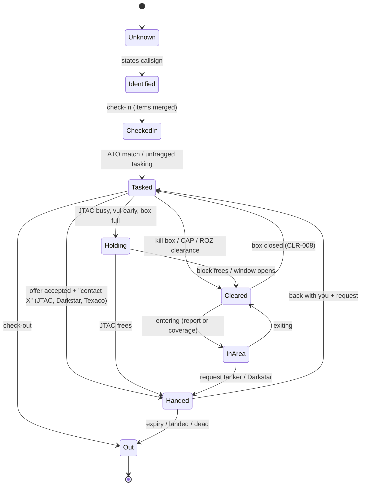

# ASOC role: design

This is the architecture that implements `requirements.md`. It follows the
user's brief and constraint of 2026-10-02 (README), the shared-logic rule,
and the conventions of AGENTS.md: Go 1.26; SI units and degrees true
inside, feet / NM / knots / magnetic only at the edges; `log/slog`;
`context.Context` first for I/O; spoken text only through
`speech/phraseology`; the `nolibopusfile` build tag; shared contracts
(`controller`, `radio`, `world`, `sim`, `nlu`, `speech`, `geo`) change only
additively and with the orchestrator's agreement (listed in §3.3).

**The hard rule.** `internal/awacs` is not touched. Every seam below either
already exists (Darkstar's `Offer`, its frequency, its exported
`Sessions` / `Groups`, the roster, the guest-episode events) or is new and
neutral, outside `internal/awacs`.

---

## 1. Principles

| # | Principle | From | Consequence in the design |
|---|---|---|---|
| P1 | The ASOC owns flow and airspace; the AIC owns the air-to-air fight; the JTAC owns terminal control. | [UB] | The ASOC's phrase catalogue has no AIC or JTAC call (`TestNoForeignCalls`); referrals instead. |
| P2 | Darkstar is unchanged. | [UC] | Only existing surfaces and new neutral seams; `TestAWACSUntouchedByASOC`. |
| P3 | Additive and removable. | [UB] | `internal/asoc` + `cmd/*/asoc*.go`; `// asoc hook` tags; import guards. |
| P4 | One core utility per cross-cutting concern. | [UR] | `controller/ident`, `world/whois`, `controller.Roster`, `world.Lifecycle`, `missionconfig` naming parse, `nlu/norm`, `controller.Handoff*`, `f10map`, `sensor` / `terrain`, voice pools, phrase cache. |
| P5 | Identity by voice. | [UR] | No transmission to a flight before it calls the ASOC; coverage is never identity. |
| P6 | Data first, sensible defaults. | [UB] | ATO and ACO from tables, drawings and DCS group tasks; a mission that only draws `KILLBOX` boxes and sets `asoc = {{freq = 264}}` works. |

---

## 2. Design elements

| ID | Element | Package / files | Responsibility |
|---|---|---|---|
| DE-ROLE | Role wiring | `cmd/overwatch/asoc.go`, `asoc_*.go` | Build agencies from the mission and server config, add them through the overlay, wrap the parser, start, register lifecycle parts, map feed, gateway directory. |
| DE-AGY | Agency controller | `internal/asoc/agency/{agency.go,handle.go,run.go}` | `controller.Controller` per frequency, plus `Questioner`, `Hinter`, `Roler`, `SpeakerLabeler`, `TransmitNotifier`, `HandoffReceiver`, `AirThreatListener`, `Overhearer`, `Enricher`, `MissionResetter`. |
| DE-IDN | Identity | `internal/asoc/agency/identity.go` | `controller/ident` book, whois resolution through the roster, coalition gate. |
| DE-SESS | Sessions and flow | `internal/asoc/agency/session.go` | Flight records, the session state machine (§7), expiry, back-with-you. |
| DE-CHK | Check-in | `internal/asoc/agency/checkin.go` | MNPOPCA merge, "as fragged", exceptions, missing items, reply composition. |
| DE-ATO | Tasking order | `internal/asoc/ato/{ato.go,match.go,infer.go}` | Lines, matching, inference from DCS group tasks, line use. |
| DE-ACO | Airspace control order | `internal/asoc/aco/{aco.go,build.go,status.go,geom.go}` | ACMs from tables, drawings and server config; statuses and windows; geometry queries. |

---

## 3. Packages and Go types

### 3.1 Layout

```
internal/asoc/
  doc.go            role overview, removal pointer
  role.go           Role: per-coalition ACO + ATO + book + directory; Parts (MissionResetter)
  gateway.go        GatewayDirectory (controller.HandoffDirectory for ATC)
  mapfeed.go        f10map.Producer for the aco layer
  imports_test.go   TestNothingImportsASOC, TestASOCImportsNoRole
  hooks_test.go     TestASOCHooksListed
  untouched_test.go TestAWACSUntouchedByASOC
  agency/           the controller (one per frequency)
  aco/              ACO model, build, statuses, geometry, block book, tankers
  ato/              ATO lines, match, inference
  coverage/         platform coverage models
  config/           mission + server config, validation, runtime API
  nlu/              kinds, slots, parser ladder, pack (embedded)
  phrase/           template catalogue and renderer
internal/airpic/    neutral, read-only air-picture view (no role imports)
cmd/overwatch/asoc.go, asoc_lifecycle.go, asoc_map.go, asoc_schema.go, asoc_test.go
cmd/overwatch/handoffs.go   neutral package-level seams (gatewayDirectory, asocCombat)
cmd/overwatch/airpic_awacs.go  adapter AWACS -> airpic.Source (reads exported methods only)
cmd/textsim/asoc.go, asoc_test.go
```

Import rules: `internal/asoc/...` may import `controller` (and its
subpackages), `discourse`, `geo`, `nlu` (and subpackages), `radio`,
`sensor`, `terrain`, `world` (and `whois`), `missionconfig`, `f10map`,
`speech` (and `phraseology`), `voicepool`, `airpic`, `config`. Never
`awacs`, `jtac`, `atc`, `aipilot` (`TestASOCImportsNoRole`).

### 3.2 Core types

```go
package asoc

// Role is the per-process ASOC state shared by the coalition's agencies.
type Role struct {
	mu    sync.Mutex
	coal  map[string]*Theatre // "blue", "red"
	clock func() time.Time
	log   *slog.Logger
	gen   uint64 // world generation the parts were built for
}

// Theatre is one coalition's ACO, ATO and books.
type Theatre struct {
	ACO   *aco.ACO
	ATO   *ato.ATO
	Book  *aco.Book        // block holders per ACM (kill box, CAP, AR, ROZ transit)
	Tank  *aco.TankerQueue // per tanker
	Dir   *GatewayDirectory
	Rev   uint64           // bumped on any status / config change (map Version)
}

// Parts is the role's world.MissionResetter (the "asoc" missionParts slot).
type Parts struct{ r *Role }
func (p Parts) OnMissionRestart(at time.Time, reason string)
func (p Parts) OnMissionReady(at time.Time, id string)
```

```go
package agency

type Agency struct {
	mu       sync.Mutex
	spec     config.Agency        // callsign, freq, platform, aic, jtacs, ...
	th       *asoc.Theatre        // shared, its own lock
	book     *ident.Book          // controller/ident (shared implementation)
	roster   *controller.Roster   // shared: whois + who was heard where
	world    world.Reader         // shared store snapshot
	cov      coverage.Model
	pic      airpic.Source        // nil = not wired (P3 re-task only)
	recv     Receivers            // agency name -> controller.HandoffReceiver, frequency
	gdir     controller.HandoffDirectory // ATC's directory (nil = ATC off)
	flights  map[string]*Flight   // "Hawg 1"
	out      chan<- controller.Outbound
	phr      *phrase.Renderer
	log      *slog.Logger
}

type Flight struct {
	Callsign  string          // "Hawg 1"
	Members   []string        // "Hawg 1-1", "Hawg 1-2"
	Voice     string          // radio sender of the lead
	Unit      uint32          // resolved after identification (whois)
	State     State           // §7
	CheckIn   controller.CheckIn
	Line      *ato.Line       // matched line (nil = unfragged)
	Task      ato.Task
	Clearance *Clearance      // current ACM clearance
	With      string          // agency it was handed to ("Landshark", "Darkstar", "Texaco 1")
	HandedAt  time.Time
	Expires   time.Time
	Held      bool            // a guest (Darkstar) episode holds routine calls
	Warned    map[string]time.Time // per ACM name
	IFREPs    []string
}

type Clearance struct {
	ACM     string   // "88AY"
	Kind    aco.Kind
	LoFt    int
	HiFt    int
	Keypads []int    // P3
	Given   time.Time
	Entered bool
}
```

`controller.CheckIn` (additive, neutral; DE-JTC):

```go
// CheckIn is a flight's check-in brief (J1 Fig V-12; A1 MNPOPCA) passed
// between agencies in Handoff.State. // asoc hook
type CheckIn struct {
	Mission     string   // "5101" ("" = none)
	Count       int
	Type        string   // DCS type or spoken ("A-10C")
	Position    string   // as said ("over Bobcat")
	AltFt       int
	Ordnance    []string // as said, normalised ("4 GBU-12")
	PlaytimeMin int
	Caps        []string // "TGP", "Link 16", "FAC(A)"
	Abort       string
	AsFragged   bool
}
```

## 4. Shared-core reuse and the seams

### 4.1 Identity: `controller/ident` + `world/whois`

The ASOC binds voices with `ident.Book` (same correction window and
lock) and resolves units only through `controller.Roster.Whois`, the one
server-wide `whois.Resolver`. It never keys anything on an SRS unit ID
(`whois/guard_test.go` covers `internal/asoc` too). The coalition gate
reads the resolved unit's coalition.

### 4.2 Lifecycle: `world.Lifecycle`

- Agencies are controllers: the Loop resets them (`OnMissionRestart`:
  drop sessions except check-ins after `MissionBegan`, clearances, warnings;
  `OnMissionReady`: nothing to say, re-read coverage platform).
- The role's shared parts are one `asoc.Parts` registered as slot `asoc`
  in `missionParts` (`cmd/overwatch/lifecycle.go`, `// asoc hook`):
  restart drops the books, tanker queues, runtime statuses and line use;
  ready re-reads the ACO / ATO (through the missionconfig watcher's
  payload), rebuilds the gateway directory and bumps `Theatre.Rev` so the
  map redraws.
- Rules: take the lock, quick, idempotent, panic-free ([ML]).

## 5. ATO data model

### 5.1 Types

```go
package ato

type Task string // "cas", "ki", "ai", "sead", "recce", "dca", "cap", "escort", "sweep", "oca", "tanker"

type Line struct {
	Mission   string   // "5101" (4 digits; mission-defined lines may use any digits)
	Callsign  string   // "Hawg 1" (flight); or
	Group     string   // DCS group name
	Type      string   // "A-10C"
	Count     int
	Task      Task
	Ordnance  []string
	Playtime  time.Duration
	VulFrom, VulUntil Window // NOTAM time forms
	JTAC      string   // persona callsign
	CP        string
	Killbox   string
	CAP       string
	Escort    string   // escorted flight callsign
	Tanker    string
	GatewayIn, GatewayOut string
	HomePlate string
	Inferred  bool
	inUse     string   // flight callsign using it this sortie
}

type ATO struct{ Lines []*Line }

func (a *ATO) Match(ci controller.CheckIn, flight, group string) (*Line, MatchHow)
func (a *ATO) Use(l *Line, flight string)
func (a *ATO) Free(flight string)
```

### 5.2 Mission table

```lua
ato = {
  { mission = "5101", callsign = "Hawg 1",  type = "A-10C", count = 2, task = "cas",
    ordnance = "4 GBU-12, 2 AGM-65", playtime_min = 45, jtac = "Landshark", cp = "Bobcat",
    vul = { from = "H+0:30", ["until"] = "H+1:30" } },
  { mission = "4101", callsign = "Viper 1", type = "F-16C", count = 2, task = "ki", killbox = "88AY" },
  { mission = "2101", callsign = "Eagle 2", type = "F-15C", count = 2, task = "escort", escort = "Viper 1" },
  { mission = "7001", callsign = "Texaco 1", group = "Texaco-1", task = "tanker", tanker_track = "Shell" },
}
```

## 6. ACO data model

### 6.1 Types

```go
package aco

type Kind string // killbox, roz, ar_track, ar_anchor, cap, gateway, cp, fscl, nfa, rfa, aca

type Status string // "open", "closed", "cold" (kill boxes); "active", "cold" (others)

type ACM struct {
	Name     string     // "88AY"
	Kind     Kind
	Shape    Shape      // polygon, circle, line (geo, true)
	LoFt     int
	HiFt     int
	Freq     radio.Frequency // optional controlling / tanker frequency
	Base     Status     // from table / drawing
	Flag     string     // user flag: 1 open/active, 2 closed, 3 cold, 0 = Base
	Window   Window
	RozKind  string     // uas, artillery, jtac, other
	Source   string     // "drawing:Blue/KILLBOX 88AY 0-180", "table:asoc[1].aco.killboxes[1]"
}

type ACO struct {
	Items   map[Kind]map[string]*ACM // lower-case name
	runtime map[string]Status        // OVERWATCH.asoc runtime + flags
}

func (a *ACO) Status(name string, at time.Time) Status
func (a *ACO) Containing(p geo.Point, altFt int, at time.Time) []*ACM
func (a *ACO) Ahead(p geo.Point, trackT, speedMS float64, d time.Duration, altFt int) []*ACM
func (a *ACO) Nearest(kind Kind, p geo.Point, st Status) *ACM

// Book holds blocks per ACM (kill box stack, CAP, AR, ROZ transits).
type Book struct{ holders map[string][]Hold }
type Hold struct{ Flight string; LoFt, HiFt int; Since time.Time }
func (b *Book) Assign(acm *ACM, flight string, wantLo, wantHi int) (lo, hi int, ok bool)
func (b *Book) Free(flight string)
```

### 6.2 Drawing grammar

Prefix, then a space, `-` or `_`, then the name; optional trailing tokens
`lo-hi` (hundreds of feet MSL) and `freq` (MHz), as ATC's `MOA <name>
[lo-hi] [freq]`. A drawing on the Blue or Red layer belongs to that
coalition; other layers and trigger zones to every coalition.

| Prefix | Shape | Block | Freq | Becomes | Parsed by |
|---|---|---|---|---|---|
| `KILLBOX <name> [lo-hi]` (also `KILL BOX`) | polygon, circle | yes | — | kill box (status from table / flag, default open) | existing built-in (AWACS) parse, unchanged |
| `CAP_<name> [lo-hi]` | circle, polygon, 2-point line | angels | — | CAP station | existing built-in parse |
| `ROZ <name> [lo-hi] [freq]` | polygon, circle | yes | controlling agency | ROZ (kind from table, default `other`) | new prefix |
| `ARTRACK <name> [lo-hi] [freq]`, `AR <name> …` | 2-point line (entry → exit) | yes | tanker / boom | AR track | new prefix |
| `ANCHOR <name> [lo-hi] [freq]` | circle | yes | tanker | AR anchor | new prefix |
| `GATEWAY <name> [lo-hi] [freq]` | circle (point), line (gate), polygon | yes | ASOC to contact | gateway (ASOC and ATC) | new prefix, read by both |

Status is never part of a drawing name (the AWACS reads `KILLBOX` names
and its parse must not change). Examples: `KILLBOX 88AY 0-180`, `ROZ
Reaper 80-120`, `ARTRACK Shell 220-240 276.1`, `GATEWAY Coyote 180-280`,
`CP Bobcat 150-200`, `FSCL`, `NFA Church`.

## 7. Session state machine and data flow



Per call (`Agency.Handle`): parse (ASOC route) → identity gate (IDN) →
coalition gate → flight lookup → kind handler (check-in, request, report)
→ reply via the phrase catalogue → `controller.Outbound` with arbiter
class. Per tick (2 s, `Agency.Run`): expiry, monitoring for flights in
coverage and not held, stacked hand-offs, status-change events.

---

## 8. Configuration

### 8.1 Mission table `OVERWATCH.asoc` (Lua)

```lua
asoc = {
  {
    callsign  = "Overlord",     -- default: OD-002 (the co-located AWACS's callsign; else "Overlord", else "Chalice")
    freq      = 264.0,          -- required, MHz, unique
    mod       = "AM",
    coalition = "blue",         -- default: the platform unit's, else blue
    platform  = "ground",       -- "ground" | "airborne" | "awacs"
    unit      = "CRC-1",        -- ground site / aircraft (not with platform "awacs")
    awacs     = "Darkstar",     -- platform "awacs": the AWACS persona it is co-located with
    antenna_ft = 50,            -- ground: antenna height AGL
    range_nm  = 200,            -- ground 200, airborne 250
    aor       = { "AOR West" }, -- zones; default: everywhere
    aic       = "Darkstar",     -- default: first AWACS persona of the coalition
    jtacs     = { "Landshark" },-- default: every JTAC persona of the coalition
    voice     = "calm",         -- alias; default: voice pool role "asoc"
    require_mission_number = false,
    infer_ato = true,           -- false: only table lines
    jtac_busy = 2,
    tankers = {
      { callsign = "Texaco 1", unit = "Texaco-1", freq = 276.1, tacan = "31Y", track = "Shell", type = "boom" },
    },
    ato = { --[[ §5.2 ]] },
    aco = { --[[ §6.3 ]] },
  },
}
```

| Field | Default | Notes |
|---|---|---|
| `callsign` | OD-002 | 1–30 characters; may equal the `awacs` persona's only with `platform = "awacs"` |
| `freq` | required | must differ from every persona, ASOC and ATC frequency |
| `platform` | `"ground"` | §ROL-005 |
| `unit` | none (unlimited coverage, warning) | DCS unit name |
| `awacs` | first AWACS persona when `platform = "awacs"` | |
| `aic`, `jtacs` | coalition's personas | names must exist (warning, ignored otherwise) |

### 8.2 Validation (examples)

| Problem | Message |
|---|---|
| Duplicate frequency | `asoc[1].freq: 251.000 AM already used by awacs[1] Darkstar` (error, agency skipped) |
| Callsign clash without co-location | `asoc[1].callsign: "Darkstar" already used by awacs[1]; set platform = "awacs" to share it` (error) |
| Unknown JTAC | `asoc[1].jtacs[1]: no JTAC persona "Landshak"; did you mean "Landshark"?` (warning) |
| Bad status | `asoc[1].aco.killboxes[2].status: "warm" must be open, closed or cold; open used` |
| Bad shape | `ARTRACK Shell: is a circle; an AR track needs a 2-point line; skipped` |
| ATO line target unknown | `asoc[1].ato[3].killbox: no kill box "88BA"; ignored` |

## 9. NLU pack, phraseology and example dialogues

### 9.1 Example setup (Nevada)

| Station | Role | Frequency | Platform |
|---|---|---|---|
| Overlord | ASOC | 264.0 AM | ground, unit `CRC-1` (Tonopah Test Range ridge, antenna 50 ft) |
| Darkstar | AIC (AWACS, unchanged) | 251.0 AM | E-3, unit `AWACS-1` |
| Landshark | JTAC | 238.5 AM | unit `JTAC-1` |
| Texaco 1 | tanker (DCS AI, not voiced) | 276.1, TACAN 31Y | AR track Shell FL220–240 |
| Nellis Clearance / Departure | ATC | 379.1 / 124.95 | |
| Los Angeles Center | ATC (area control) | 133.95 | |

ACO: kill boxes 88AY (open) and 88AZ (closed), surface–18,000; ROZ
Reaper (UAS, 8,000–12,000); NFA Church (in 88AY); CAP Tiger 20–30; CP
Bobcat 15,000–20,000; gateways Coyote (north, FL180–280) and Tikaboo.
ATO: 5101 Hawg 1 CAS, 4101 Viper 1 KI 88AY, 2101 Eagle 2 escort Viper 1,
2102 Uzi 1 DCA (AI).

### 9.2 Intents and slots

| Kind | Example utterances | Slots |
|---|---|---|
| `asoc_check_in` | "Overlord, Hawg 1-1, mission five one zero one, checking in as fragged" / full MNPOPCA | mission, count, type, position, alt, ordnance, playtime, caps, abort, as_fragged, exception |
| `asoc_back_with_you` | "back with you", "checking back in", "returning to your frequency" | request (nested) |
| `asoc_push` | "pushing Landshark", "push", "switching Darkstar" | agency |
| `asoc_request_tasking` | "request tasking", "ready for tasking", "request retask CAS" | task |
| `asoc_request_killbox` | "request kill box eight eight alpha yankee", "request a kill box" | killbox |
| `asoc_report_area` | "entering eight eight alpha yankee", "exiting the box", "clear of Reaper" | acm, entering/exiting |

Extractors reused from `internal/nlu/entity` (ordnance, playtime,
altitude / angels, frequency, callsign, numbers); new ones in
`internal/asoc/nlu/slots.go`: mission number (4 digits, "mission number"
or "mission"), CGRS kill box names (digits + NATO letters, STT variants
"alpha yankee" / "a y"), blocks, agency names via `norm.MatchStation`.

The parse ladder mirrors the JTAC's: fast-path rules and the pack's
examples first (answer now), the LLM enrichment (`controller.Enricher`)
for check-ins only, the shared clarify ladder for misses.

## 10. Degraded modes

| Condition | Behaviour | Requirement |
|---|---|---|
| World feed down | sessions kept, "not radar contact", no monitoring | DEG-001 |
| LLM down | fast path only | DEG-002 |
| No AWACS persona | DCA flights to CAP on the ASOC frequency, AIC requests "no AIC available" | DEG-003 |
| No JTAC | kill box offer or hold | DEG-004 |
| ATC role off | gateway clearances out with "frequency change approved"; no gateway hand-ins | GTW-007 |
| Platform destroyed | the agency goes silent and leaves the directory | COV-005 |

---

## 11. Performance budgets

| Item | Budget |
|---|---|
| Decide a reply (excluding TTS) | ≤ 50 ms at 20 sessions |
| Tick (2 s): monitoring all sessions | ≤ 1 ms per flight |
| DCS calls | none of its own besides the shared store and the 2 s watch keys |
| Air picture adapter | ≤ 1 call per 5 s, cached |

---

## 12. Removal

The role comes out as if it never existed.

### 12.1 Paths to delete

- `internal/asoc/` (all, with `nlu/pack` and tests);
- `internal/airpic/` (only the ASOC uses it);
- `cmd/overwatch/asoc.go`, `asoc_lifecycle.go`, `asoc_map.go`, `asoc_schema.go`, `asoc_test.go`, `airpic_awacs.go`;
- `cmd/textsim/asoc.go`, `asoc_test.go`, scripts `cmd/textsim/testdata/asoc-*.txt`;
- `docs/asoc-spec/`; the `-- asoc: begin` … `-- asoc: end` and runtime-API blocks of `docs/overwatch-mission-config.lua`.

### 12.2 Hooks in shared code (`// asoc hook`)

Find them with `grep -rn "asoc hook" --include=*.go .` Planned:

| File | Hook | Purpose |
|---|---|---|
| `cmd/overwatch/main.go` | `setupASOC`, parser wrap, `start`, `parts.asoc` | wiring |
| `cmd/overwatch/lifecycle.go` | `lcASOC` slot | LCY-002 |
| `cmd/overwatch/overlay.go` | named extra sets | ROL-003 |
| `cmd/overwatch/handoffs.go` | new: `asocCombat`, `gatewayAgency` (nil by default) | GTW-003…008 |
| `cmd/overwatch/atc.go` | `atcCombat` consults `asocCombat` | GTW-004 |
| `cmd/overwatch/atc_areas.go` | gateway agency from `gatewayAgency` | GTW-003 |

**Not in the list: `internal/awacs`** (no hook, `TestAWACSUntouchedByASOC`).
