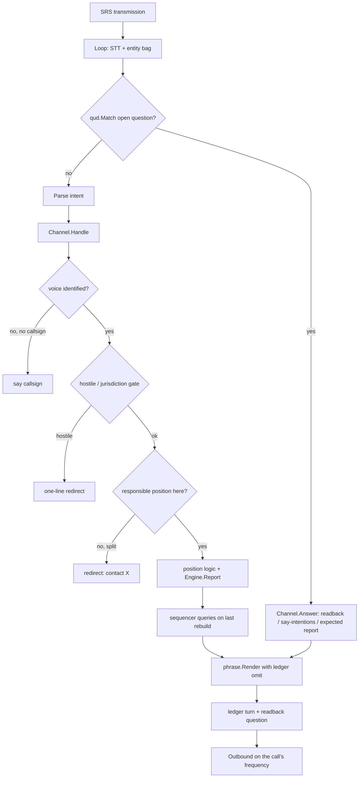

# ATC role: design

This is the architecture that implements `requirements.md`. It follows the
decisions of `docs/atc-design.md` (D1–D12), `docs/atc-procedures.md` and
`docs/atc-terminal-procedures.md`, and reconciles them with the scaffold in
`internal/atc`. Section 12 maps every requirement to its design elements.

Conventions (AGENTS.md): Go 1.26; SI units and degrees true inside,
feet / NM / knots / magnetic only at the edges; `log/slog`; `context.Context`
first for I/O; spoken text only through `speech/phraseology`; the
`nolibopusfile` build tag; shared contracts (`controller`, `radio`, `world`,
`sim`, `nlu`, `speech`, `geo`) change only additively and through the
orchestrator (listed in §7.14).

---

## 1. Principles

| # | Principle | From | Consequence in the design |
|---|---|---|---|
| P1 | The frequency decides who hears a call; position decides who should. | D1 | One `controller.Controller` per facility frequency; `atc.Responsible` only drives redirects and handoffs. |
| P2 | Zero config first, layered overrides. | D2 | `DE-REG` builds a working default from DCS + map pack; `DE-CFG` layers the mission table on top. |
| P3 | Combined positions by default. | D3 | A `Facility` carries `Combined []AgencyKind`; one voice book, one ledger set, no internal handoff transmissions. |
| P4 | Lazy staffing. | D4 | `DE-STAFF` starts SRS clients only for tuned facilities. |
| P5 | No service in hostile airspace; jurisdiction is the airspace. | D5, D8 | `DE-JUR` is a gate evaluated before every rule; `DE-HOS` is part of it. |
| P6 | Procedures are data; geometry places, speech picks the branch. | D9 | `DE-PROC` engine + `DE-YAML` step graphs; arbitration table in the engine. |

---

## 2. Design elements

Every requirement's **Design** field names one or more of these.

| ID | Element | Package / files | Responsibility |
|---|---|---|---|
| DE-REG | Registry | `internal/atc/registry.go` | Airbases, runways, frequencies, facilities, variants and voices per mission; rebuilt on config change. |
| DE-STAFF | Staffer | `internal/atc/staff/staffer.go` | Lazy staffing from the SRS roster; release; cap; SRS client per facility. |
| DE-FAC | Facility controller | `internal/atc/facility/{facility.go,handle.go,run.go,questions.go}` | Implements `controller.Controller`, `Questioner`, `Hinter`, `Roler`, `SpeakerLabeler`, `TransmitNotifier` per frequency; owns the facility state lock. |
| DE-IDN | Identity and flight table | `internal/atc/flights.go` | Voice book (`ident.Book`), `FlightTable` (flights, members, unit binding), lifetimes. |
| DE-ASP | Airspace model | `internal/atc/airspace.go` (scaffold) + `internal/atc/airspace/{build.go,drawings.go,restricted.go,nasr.go}`, `internal/atc/airspace/data/us_class.yaml` (generated by `internal/atc/airspace/nasrgen`) | Build airspace from sources; membership; entry rules. Source chain per airbase (first wins): mission `class` (a provider area of another class is dropped, the field estimated in the mission class) > ME drawings / trigger zones `CLASS B\|C\|D` (`drawing`) > published real-world data: FAA NASR Class B/C/D for the US maps (Nevada, Marianas; `faa`; matched by the FAA reference point within 4 km, used only when its surface area covers the field 1.5 km around) > estimate (`synthesized`, drawn `(est.)`): `atc.SynthesizeTerminal` of `ClassOf` (heuristic `atc.ClassFor`: military D; civil B demoted to C, OD-007; a major multi-runway or international airport never D; a field under another airport's published B/C at most D). |
| DE-JUR | Jurisdiction gate | `internal/atc/jurisdiction.go` | `Gate(fac, flight, snapshot)`: in airspace / on frequency asking / handed off; hostile check first. |

---

## 3. Packages and Go types

### 3.1 Layout

```
internal/atc/                 package atc: shared types (scaffold) + small cross-cutting pieces
  agency.go airspace.go atis.go carrier.go flight.go guard.go handoff.go
  runway.go selector.go staffing.go taxi.go            (scaffold; changes in §3.2)
  registry.go flights.go jurisdiction.go hostile.go formation.go emergency.go
  gear.go wx.go civil.go codes.go world.go obs.go health.go clock.go
  proc/        engine, predicates, frames, arbitration, YAML loader; data/*.yaml
  proc/seq/    runway, separation, stack (marshal/holding), deck
  proc/traj/   test-only trajectory builder
  profile/     pattern profiles (YAML) and category mapping
  facility/    the controller.Controller implementation and position logic
  ground/      ledger integration (common ground) and readbacks
  phrase/      templates and rendering; data/*.tmpl
  taxi/        planner, namer, progressive taxi
  radar/       radar contact, flight following, entry, traffic, MVA
  traffic/     AI traffic: sources, type names, projection (straight line, routes), budget
  term/        terminal procedures (model, sources, generator, compiler, vectorizer, hold, conformance)
  gca/         PAR / ASR / CCA talkers
  cv/          carrier ship, case, marshal, departures, EMCON
  atis/        ATIS generator and broadcaster
  notam/       NOTAMs and ATIS remarks
  guard/       outreach manager
  staff/       staffer (SRS clients)
  vfr/         fighter VFR routes: sources, drawing parser, generator, compile to proc, conformance
internal/civil/  Overwatch-managed civil traffic (docs/atc-civil-traffic.md); imports atc, never imported by it
cmd/procpack/  procedure pack tooling
cmd/textsim/   -role atc
internal/missionconfig/atc.go  OVERWATCH.atc reading and validation
internal/nlu/packs/atc/        pack (embedded from M1)
```

Dependency direction (no cycles): `atc` ← `atc/proc` ← `atc/proc/seq` ←
`atc/term` ← `atc/traffic` ← `atc/{radar,gca,cv,atis,notam,guard,ground,phrase,taxi}` ←
`atc/facility` ← `atc/staff` ← `cmd/overwatch`. `atc/proc` holds the
`Flight`/`ProcState` it needs through package `atc` types (P §4.1 puts
`ProcState` in `atc` to avoid the cycle).

### 3.2 Scaffold reconciliation (what changes)

| File | Keep | Change (all additive unless marked) | Req |
|---|---|---|---|
| `agency.go` | `AgencyKind`, `Suffix`, `Standard`, `FacilityID`, `Airbase`, `Facility`, `StationName` | `Variant` gains `Service Service` (`usaf`, `usn`, `usa`, `uk`, `civil`) and `ICAONumbers bool`; `Facility` gains `Spoken string`, `ATISFreq *radio.Frequency`, `Profile string`; `Airbase` gains `Runways []RunwayEnd`, `Class Class`, `TransAltFt int`, `Staffed bool`, `Gear []GearSpec` | PHR-001, PAT-013, GEAR-002 |
| `flight.go` | `Phase`, `Flight`, `IFRClearance` | `Flight` gains `Group string`, `Members []*Member`, `Proc ProcState`, `Term *TermState`, `Flags FlightFlags`, `Category Category`, `Caps string` (profile id), `Voices []string`; `Member`, `ProcState`, `Pending`, `Disputed`, `Transition`, `Evidence`, `Confidence` as in P §4.1; `PhaseUnidentified` kept for guard | IDN-005, PAT-020, FRM-001 |
| `handoff.go` | `Handoff`, `HandoffReason`, `ContactPhrase` | `Handoff` gains `Proc *ProcSnapshot`; `HandoffReceiver` **moves** to `controller` (OD-009) with a type alias left here for one release | HND-001, HND-002 |
| `guard.go` | `GuardsFor`, `OutreachStep`, `GuardPolicy`, `Outreach.Next` | add `GuardLimiter` (server-wide gap and hourly cap, shared with AWACS through `controller`) and `Outreach.Record(step, now)`; `GuardsFor` takes the SRS guard receivers once `radio.ClientRadios` exposes them (OD-011) | GUA-004, GUA-008 |
| `atis.go` | `Weather`, `ATISInfo`, `ATISGenerator`, `NextLetter`, `NeedsUpdate` | `ATISInfo` splits `Remarks` into `Threats []string`, `Notams []string`, `Remarks []string` (order fixed) and gains `Time time.Time`; `NeedsUpdate` compares all three | ATI-001, ATI-004, NTM-015 |
| `runway.go` | `RunwayEnd`, `Headwind`, `RunwayInUse`, `RunwayWords` | `RunwayInUse` gains a `closed func(string) bool` parameter variant `RunwayInUseOpen` (the old function stays) | TWR-012, NTM-004 |

The draft NLU pack `internal/nlu/packs/atc` becomes a real pack in M0
(embedded, kinds registered as `nlu.IntentKind`, slot extractors added).

## 4. Data flow

### 4.1 Per transmission (`Channel.Handle`, the hot path)

Target: < 5 ms before TTS (ATC-NFR-PERF-001). No DCS call; reads the last
`Snapshot`.



| # | Step | Element | Notes |
|---|---|---|---|
| 1 | Loop delivers `Inbound` (transcript, entity bag, intent, voice, unit). Before parsing, the Loop has already offered it to `OpenQuestions` (qud.Match) and called `Answer` on a match. | `controller.Loop`, DE-FAC | readbacks, "say intentions", expected reports (with `qud.Question.Kinds`, OD-012) |
| 2 | Blocked → "Blocked, say again." | DE-FAC | IDN-011 |
| 3 | Resolve identity: `ident.Book.Resolve`; unknown voice with no callsign → "Station calling …, say callsign." and stop. | DE-IDN | IDN-001..003 |
| 4 | Bind unit on first identification; attach member; create/reuse flight. | DE-IDN, DE-FRM | IDN-004/005 |
| 5 | Air-to-air call (addressed to another station) → ignore. | DE-FAC | IDN-012 |
| 6 | Hostile check → one-line redirect (OD-044) and stop. | DE-HOS | HOS-003 |

### 4.2 Per tick (`Channel.Run` of the first channel: the facility loop)

The facility loop owns a min-heap of `(due, aircraft)` and a set of
periodic jobs. It holds the facility lock only while evaluating.

| Period | Job | Element |
|---|---|---|
| ≤ 500 ms | pop due aircraft; for each: pose in the procedure frame → exits in order (hold count) → transition → OnEnter actions → timers; re-schedule at the step's tick | DE-PROC |
| on dirty / 1 s (arrival < 5 NM) / 5 s | rebuild sequencers; go-around trigger for `final` entries (500 ms); break decisions until the bow | DE-SEQ, DE-BRK, DE-DECK |
| 1 s | conformance episodes; low altitude alert; traffic conflicts (worked flights × targets, straight line or route legs; AI formations merged); vectors for traffic; budget ranking | DE-CNF, DE-RAD, DE-AIT |
| 1 s | PAR/CCA talkers (geometry), transmissions every 5 s | DE-GCA |
| 2 s | jurisdiction sweep: leaving (30 s), outside traffic obstacles, instantiation of procedures (5 s) | DE-JUR, DE-PROC |
| 5 s | guard outreach manager; ATIS update check; NOTAM activity; carrier case tracker and BRC drift | DE-GUARD, DE-ATIS, DE-NOTAM, DE-CV |

Unsolicited calls produced by the jobs go to `TxQueue` with a class and a
recompose function; the queue feeds the Loop's `out` channel, where the
arbiter applies the ATC class rules (§6).

## 5. State machines

Notation: **state** — event [guard] / action → next state.

### 5.1 Facility staffing

| From | Event | Guard | Action | To |
|---|---|---|---|---|
| Unstaffed | roster poll | a client tuned to any frequency, or outreach/handoff need | build controllers, `Loop.SetControllers`, tune SRS | Staffed |
| Unstaffed | roster poll | cap reached and no releasable facility | WARN once | Unstaffed |
| Staffed | roster poll | nobody tuned | start idle timer | Idle |
| Idle | roster poll | a client tuned | stop timer | Staffed |
| Idle | 5 min | silent, works no flight, no open handoff | remove controllers, close SRS | Unstaffed |
| Idle | 5 min | works a flight | keep | Idle |

#### 5.1.1 Tune detection (DE-STAFF)

Works on a dedicated server with any stock SRS client; nothing runs on the
player's PC. Inputs are only what Overwatch's own SRS client sees and DCS-gRPC.

- **Roster.** The SRS server's client-sync, client-update and radio-update
  messages carry each client's radios (frequency in Hz, modulation, guard),
  name, coalition and unit id. Overwatch's client (EAM, `srs.coalition`)
  keeps every client of its coalition **and every spectator-coalition client**
  (SRS reports Neutrals, or nothing, for some players in a jet):
  `simpleradio.Client.ListenerRoster` → `radio.RadiosReader.ClientRadios`.
  Opposing-coalition clients are not kept (a red facility needs a red client
  set, FAC-017). The IFF roster (`Roster`, transponders) is unchanged.
- **Matching.** Every AM/FM radio of a client counts (several radios per
  client; intercom and disabled radios are skipped). Frequencies are rounded
  to the kHz (`radio.MHz`) and match a facility frequency of the same
  modulation exactly.
- **Client side.** Resolved per poll (`staff.Options.ClientCoalition`): the
  DCS unit of the SRS unit id when DCS-gRPC knows it (SRS usually carries the
  DCS object id, which DCS-gRPC does not), else the one player unit whose
  player name is the SRS client name (either part of "Callsign | Name"), else
  the SRS-reported side, else unknown.
- **Eligibility.** A neutral or coalition-less facility: any client. A side's
  facility: a client of that side, or a client of unknown side (spectator,
  no unit) when the role serves that coalition; a client of the other side is
  refused (coalition mismatch). A facility of a coalition without a client set
  is refused.
- **Logging.** Every decision per client and frequency is logged at INFO when
  it changes (`atc: staffing decision`: eligible, or refused with the reason:
  frequency not an ATC facility, coalition mismatch, no client set), followed
  by `atc: staffed …` or the cap warning.
- **Assumption.** The SRS server sends client syncs of every client to every
  client (also with coalition security on, which filters audio, not syncs);
  if a server withholds the other clients' radios, nothing can be staffed and
  no decision is logged.

## 6. Transmit queue and arbiter classes (DE-TXQ)

| Class | Priority | Quiet | Repeat (same Key) | AfterHeard | Notes |
|---|---|---|---|---|---|
| `atc.safety` (go around, stop, hold position, traffic alert, LAA) | PriorityFlash, Critical | 0 | 0 | 0 | never held (TWR-015 exception) |
| `atc.emergency` | 95 | 0 | – | 0.5 s | |
| `atc.pace` (PAR/CCA) | 90 | 0 | – | 0 | holds the frequency ~60% |
| `atc.deadline` (spin before the bow, Delta) | 80 | 0 | – | 0.5 s | dropped if the deadline passed |
| `atc.correction` (readback corrections) | Immediate | – | – | – | replies (not arbitrated) |
| `atc.seq` (numbers, break point, re-enter) | 20 | 3 s | 20 s | 2 s | recompose at dequeue |

Quiet phases (TWR-015): a call to a flight on short final / rolling / in
the initial climb waits unless its class is `atc.safety`.

---

## 7. Interfaces to existing packages

### 7.1 `controller`
- Implements `Controller`, `Questioner`, `Hinter`, `Roler`, `SpeakerLabeler`, `TransmitNotifier` (existing interfaces).
- Uses `ArbiterConfig` with the classes of §6 (`ArbiterForVerbosity` gains an ATC preset).
- **Proposed (OD-009):** `controller.HandoffReceiver` (moved from `atc`), `controller.GuardLimiter` shared with AWACS guard calls.
- Uses `Loop.SetControllers` for lazy staffing, `Roster` for handoff naming.

### 7.2 `controller/qud`, `controller/clarify`, `controller/ident`
- `qud.Question` per readback / expected call / "say …" question. **Proposed additive field (OD-012):** `Kinds []string` so a bare "Initial" matches `report_pattern:initial`.
- New slots needed: `Runway`, `Altitude`, `Heading`, `Frequency`, `Fuel`, `ATISLetter` (additive consts; extractors in `nlu/entity`).
- `clarify.Book{Ladder: true}`; ATC options table (`clarify.Generic` entries for ATC kinds).
- `ident.Book` per facility group (unchanged).

## 8. Configuration schema

### 8.1 Mission table `OVERWATCH.atc` (Lua)

Every field is optional. Units: frequencies MHz (AM unless `{ mhz, "FM" }`),
altitudes feet, distances NM, courses magnetic.

```lua
OVERWATCH = {
  atc = {
    enabled     = true,                 -- default: server atc.enabled
    standard    = "faa",                -- "faa" | "icao"; default: theatre (Nevada faa, else icao)
    service     = "usaf",               -- default service at military fields: "usaf" | "usn" | "usa" | "uk"
    coalitions  = { "blue", "neutral" }, -- default: server atc.coalitions ({ "blue", "neutral" })
    time_format = "zulu",               -- "zulu" | "local" (FAA variant only)
    silence_dcs_atc = false,            -- OD-002
    rnav_fighters   = false,            -- T §3.7
    enforce_speeds  = false,            -- ASP-017
    rev = 0,                            -- bumped by the runtime API (CFG-014)

    airbases = {
      Nellis = {
        staffed  = true,
        spoken   = "Nellis",
        military = true,                -- default: DCS airbase category
        service  = "usaf",
        standard = "faa",               -- per-field override
        class    = "C",                 -- "B" | "C" | "D" | "E" | "G"
        runway   = "21L",               -- calm-wind / preferred runway
        transition_altitude_ft = 18000, -- ICAO default 6000
        voice    = "gruff",
        freqs = {
          tower = { 327.0, 132.55 }, ground = 275.8, clearance = 379.1,
          approach = 124.95, departure = 124.95, atis = 270.1,
        },
        codes = { 4101, 4177 },         -- beacon code range (octal digits), default per facility
        departures = { { name = "vectors", heading = 210, altitude = 7000, expect = 17000 } },
        approach = "HI-TACAN-21L",      -- pinned approach (T §3.8)
        par = true, asr = true,         -- default: military field
        pattern = {                     -- per category; fields as PatternSet (§3.3)
          fighter = { altitude_ft_agl = 1500, initial_ft_agl = 2000, initial_nm = { 6.5, 1.5 },
                      break_point = "approach_end", turn = "left", reentry = "Church",
                      go_around_alt_ft = 5000, go_around_heading = "runway",
                      saturation = 8, local_climbout = false,
                      rsrs = { enabled = false, same_day_ft = 3000, other_ft = 6000,
                               heavy_fs_ft = 8000, touch_and_go_behind_full_stop_ft = 6000 },
                      sfo = { allowed = false, high_key_ft = { 8000, 13000 }, low_key_ft = { 4000, 6000 } } },
          heavy   = { altitude_ft_agl = 1500, initial_ft_agl = 2000, break_assigned = true,
                      departure_cap_ft_agl = 1000, go_around_alt_ft = 4000, saturation = 6 },
          trainer = { altitude_ft_agl = 1000 },
          helicopter = { altitude_ft_agl = 500 },
        },
        gear_call_reply = "none",       -- "none" | "roger" (USAF gear-down reply)
        arresting_gear = { { runway = "21L", from_threshold_ft = 1500, kind = "BAK-12" } },
        hung_ordnance_runway = "03R",
        jettison_area = "JETTISON North",
        hot_pads = { "HOTPAD Alpha" },
        local_climbout = false,
        min_fuel_priority = false,      -- base-local option, default off (SEQ-004)
        obstacle_allowance_ft = 200,
      },
      Creech = { staffed = false },
    },

    approach = { { name = "Nellis", freq = 124.95, airbases = { "Nellis", "Creech" }, radius_nm = 30,
                   ceiling_ft = 15000, spoken = "Nellis", rapcon = false } },
    center   = { { name = "Los Angeles", freq = 133.95 } },

    carriers = { { unit = "CVN-71", callsign = "Rough Rider",  -- optional: else cv/data/carrier_names.yaml by DCS type / hull
                   marshal = 285.0, approach = 264.0, departure = 283.0, tower = 305.0,
                   case = "auto", emcon = "none",        -- "none" | "zip_lip" | "emcon"
                   nmax = 6, interval_s = 50, divert = "Batumi", bingo = 3.2,
                   tanker = "Texaco" } },

    hostile = { zones = { "HOSTILE*", "MEZ*" },
                lines = { { name = "FLOT", hostile_side = "north" } },
                enemy_airbases = true, roe = true, aor = true },

    guard = { enabled = true, grace_s = 60, spacing_s = 45, own_calls = 1, guard_calls = 2,
              cooldown_s = 600 },

    flights = { { callsign = "Viper 1", units = { "Viper-1-1", "Viper-2-1" } } },

    atis = {
      remarks = { { id = "R1", text = "MANPADS alert, exercise extreme caution, north of the field" } },
      airbases = { Nellis = { remarks = {
        { id = "R2", text = "Hot pits open on the east ramp", from = "H+0:30" },
        { id = "R3", text = "Expect overhead runway two one left", flag = 7 } } } },
    },

    notams = {
      { id = "N1", airbase = "Nellis", kind = "runway_closed", runway = "03L/21R",
        from = "H+0", ["until"] = "H+2:00", text = "Runway 03L/21R closed, construction" },
      { id = "N2", airbase = "Nellis", kind = "navaid_out", navaid = "LSV" },
      { id = "N3", kind = "airspace_active", zone = "R-4806", from = "12:00Z", ["until"] = "15:00Z" },
      { id = "N4", airbase = "Creech", kind = "text", text = "Bird activity reported vicinity of the field", flag = 42 },
    },

    fixes = { HOKUM = { lat = 36.5, lon = -115.2 } },   -- T §4.5
    procedures = { },                                    -- T §4.5 (Lua)
    procedures_yaml = nil,                               -- T §4.5 (YAML string)
    generate = { radial_departures = false, rnav = false },
    capabilities = { ["F-16C_50"] = { rnav_terminal = "partial" } },  -- T §3.7 overrides
  },
}

-- F10 map layer (docs/f10-map-layer.md §10.1): a top-level table, beside atc
-- OVERWATCH.map = { enabled = true, coalitions = { "blue" },
--   layers = { airspace = true, hostile = true, awacs = true, notams = true, vfr = true,
--              fixes = true, procedures = false, civil = false, legend = false },
--   procedures = { airports = { "Nellis" }, kinds = { "approach" }, active_runway_only = true },
--   drawings = "label", public_airspace = false, palette = { }, labels = { scale = 1.0 },
--   legend = { anchor = "auto" }, menu = false, max_marks = 500 }

-- Runtime API (defined by the mission template, OD-046)
-- OVERWATCH.notam{ id=..., ... } ; OVERWATCH.notam_cancel("N1")
-- OVERWATCH.atis_remark{ id=..., ... } ; OVERWATCH.atis_remark_cancel("R2")
-- The shim (docs/overwatch-mission-config.lua, "atc runtime API") keeps
-- OVERWATCH.atc.runtime = { notams = { [id] = {...} }, notam_cancel = { [id] = true },
--   remarks = { [id] = {..., airbase = "Nellis"} }, remark_cancel = { [id] = true } }
-- and bumps OVERWATCH.atc.rev; an add replaces the id from any source, a
-- cancel removes it (atcconfig.RuntimeOps).
-- frequency_change: { kind = "frequency_change", airbase = "Nellis",
--   position = "ground" (default tower), freq = 275.3, old = 275.8 (default
--   the position's first) }
```

### 8.2 Validation table

| Path | Type | Default | Validation | Req |
|---|---|---|---|---|
| `atc` | table | absent = zero-config if server-enabled | not a table → defaults + announcement | CFG-003, DEG-007 |
| `atc.enabled` | bool | server `atc.enabled` | – | CFG-012 |
| `atc.standard` | enum faa/icao | theatre | enum | PHR-001 |
| `atc.service` | enum | usaf | enum | PHR-001 |
| `atc.coalitions` | list of enum | server `atc.coalitions` (default `{ "blue", "neutral" }`) | blue/red/neutral; red without client set → warning | FAC-017 |
| `atc.time_format` | enum | zulu | enum | PHR-012 |

## 9. Error handling and degraded modes (DE-DEG)

| Condition | Detection | Behaviour | Req |
|---|---|---|---|
| DCS-gRPC down | stream error / no sample 5 s for all units | pilot-only mode for all flights; radar services refused ("unable radar service"); last weather kept (flag stale), omitted after 30 min; registry frozen; no new facilities needing registry data | DEG-001, IDN-006 |
| One unit stale | no sample 5 s | ConfLost for that flight; 60 s → slot release | PAT-028 |
| No map pack airfield | registry build | runways from DCS / mission; "taxi at your discretion"; hold-short and clear by report; pattern frame from DCS runway data | DEG-002, GND-015 |
| No taxiway names | namer returns "" | progressive taxi | GND-006 |
| No terminal procedures | loader empty | vectors + visual / overhead / PAR-ASR (if generated) | DEG-003 |
| Procedure YAML invalid (embedded) | `proc.Load` at start | test prevents shipping; at runtime: procedure dropped, ERROR log | TST-005 |

Health flags (`atc.Health`: `GRPC`, `MapPack`, `TTS`, `SRS`) are logged on
change and exposed in `/state`.

---

## 10. Performance budgets

| Item | Budget | Measure | Req |
|---|---|---|---|
| `Handle` parse-to-text | p99 < 5 ms | benchmark with 20 flights | PERF-001 |
| Tick per aircraft | ≤ 20 µs | benchmark | PERF-002 |
| 100 aircraft / 5 facilities / 1 Hz | ≈ 1 ms CPU/s | pprof | PERF-002 |
| Sequencer rebuild (12 entries) | < 50 µs | benchmark | PERF-006 |
| `DecideBreak` | < 20 µs | benchmark | PERF-006 |
| Taxi plan (≤ 2,000 nodes) | < 1 ms | benchmark | PERF-005 |

---

## 11. Phrase template catalogue (ids)

Templates live in `internal/atc/phrase/data/*.tmpl`; ids used by YAML and
code. `(c)` = composed.

| Group | Ids |
|---|---|
| general | `gen.say_callsign`, `gen.radio_check`, `gen.say_again`, `gen.blocked`, `gen.verify_position`, `gen.say_position`, `gen.say_intentions`, `gen.how_do_you_read`, `gen.freq_change_approved`, `gen.contact`, `gen.redirect`, `gen.unable_hostile` (c), `gen.affirm`, `gen.negative`, `gen.terminated_contact`, `gen.terminated` (handoff.tmpl) |
| ground | `gnd.taxi`, `gnd.taxi_progressive`, `gnd.turn_next`, `gnd.cross`, `gnd.hold_short`, `gnd.hold_position`, `gnd.taxi_parking`, `gnd.taxi_discretion` (c), `gnd.startup` (ICAO), `gnd.verify_route` (c) |
| tower | `twr.takeoff`, `twr.luaw`, `twr.cancel_takeoff`, `twr.stop`, `twr.land`, `twr.touch_and_go`, `twr.low_approach`, `twr.option`, `twr.go_around`, `twr.go_around_ifr`, `twr.local_climbout`, `twr.report_initial`, `twr.initial_ack`, `twr.break_at`, `twr.number_follow`, `twr.closed_approved`, `twr.unable_closed`, `twr.reenter`, `twr.extend_downwind`, `twr.straight_in`, `twr.enter_downwind`, `twr.traffic`, `twr.info`, `twr.runway_change` (bcast), `twr.remain_outside`, `twr.dep_direction`, `twr.check_wheels` (usn/usa), `twr.gear_roger`; M2: `twr.sequence`, `twr.unable_overhead`, `twr.saturated_hold` (c), `twr.go_around_heavy`, `twr.takeoff_remark`, `twr.runway_closed` (bcast), `twr.runway_open` (bcast), `frm.split_approved`, `frm.split_element` |
| clearance | `clr.ifr`, `clr.readback_correct`, `clr.squawk`, `clr.reset_squawk` |
| radar | `rad.contact`, `rad.not_in_contact`, `rad.contact_lost`, `rad.vector`, `rad.alt`, `rad.expect_app`, `rad.cleared_app`, `rad.vectors_final`, `rad.terminated`, `rad.speed`, `rad.hold`, `rad.hold_published`, `rad.efc`, `rad.delay`, `rad.missed`, `rad.alt_missed`, `rad.class_b_cleared`, `rad.class_b_remain_clear`, `rad.leaving_b`, `rad.restricted_unable`, `rad.popup_terrain`, `rad.ff_contact`, `rad.traffic`, `rad.unknown_traffic`, `rad.vector_traffic`, `rad.alt_traffic`, `rad.clear_of_traffic`, `rad.traffic_alert`, `rad.laa`, `rad.cnf.*` |
| gca | `par.this_will_be`, `par.lost_comm`, `par.approaching_gp`, `par.wheels`, `par.begin_descent`, `par.gp`, `par.course`, `par.range`, `par.dh`, `par.too_low_go_around`, `asr.range_alt`, `asr.mda`, `asr.map`, `cca.lock_on`, `cca.concur`, `cca.disregard`, `cca.soft_heading`, `cca.minimums` |

---

## 12. Traceability (requirement → design elements)

Generated from the **Design** field of each requirement. "Main files"
lists the package path of the first element.

| Requirement | Title | Pri | Design elements | Main files |
|---|---|---|---|---|
| ATC-FR-IDN-001 | Unidentified caller | MVP | DE-IDN, DE-FAC | `internal/atc/flights.go` |
| ATC-FR-IDN-002 | Voice binding on the first stated callsign | MVP | DE-IDN | `internal/atc/flights.go` |
| ATC-FR-IDN-003 | Callsign correction window and lock | MVP | DE-IDN | `internal/atc/flights.go` |
| ATC-FR-IDN-004 | Position only after identification | MVP | DE-IDN, DE-WORLD | `internal/atc/flights.go` |
| ATC-FR-IDN-005 | Flight and member records | MVP | DE-IDN, DE-FRM | `internal/atc/flights.go` |
| ATC-FR-IDN-006 | Pilot-only mode | MVP | DE-PROC, DE-IDN | `internal/atc/proc/{engine.go,pred.go,leaves.go,arbitrate.go,load.go,phase.go}` |
| ATC-FR-FAC-018 | DCS's own ATC | P3 | DE-WORLD | `internal/atc/world.go` |

## 13. Removal

The ATC role is built to be deletable as if it never existed (common rule
of M0): all ATC code lives under `internal/atc/`, only the wiring files
import it, and shared packages carry small generic extension points tagged
`// atc hook`. With the role off (no `atc: enabled: true`) the server and
textsim behave byte-identically to a tree without it.

**Checks.** `grep -rn "atc hook" --include='*.go' .` lists every hook;
`TestNothingImportsATC` in `internal/atc/imports_test.go` fails if anything
outside `internal/atc` other than `cmd/overwatch/atc*.go` and
`cmd/textsim/atc*.go` imports `internal/atc/...`. After a removal, the grep
shows only the generic hooks kept (table below), and `go build ./...`
proves nothing else referenced the role.

### 13.1 Paths to delete

ATC-only files outside `internal/atc/` (as of M1):

- `internal/atc/` (the whole tree, its tests and embedded data: procedures,
  phrase templates, taxi overlays, traffic names).
- `cmd/overwatch/atc.go`, `cmd/overwatch/atc_test.go` (server wiring:
  registry build incl. radio.lua search and the public frequency table,
  staffer, voice adapter).
- `cmd/overwatch/overlay.go`, `cmd/overwatch/overlay_test.go`,
  `cmd/overwatch/overlay_group_test.go` (M2: the SRS client groups of
  extra controllers, `radioGrouper`): the
  controller overlay (generic, names no ATC symbol, but only `atc.go`
  installs it; delete it with the role or keep it unused).
- `cmd/textsim/atc.go`, `atc_cmds.go`, `atc_degraded.go`, `atc_env.go`,
  `atc_mission.go`, `atc_test.go`, `atc_scripts_test.go`,
  `atc_scripts_s11_test.go` (textsim `-role atc`, its commands and the
  script runners).
- `cmd/overwatch/atc_map.go` (M2: the ATC producers of the F10 map layer
  over the role's mission model, `atcRole.mapFeeds`) and
  `cmd/textsim/atc_map.go`, `atc_map_test.go` (textsim `/map`, `@map`,
  `@map-count`, `@map-none` over the fake drawer) and
  `cmd/textsim/atc_map_m5.go` (M5, T-M5-29: the vfr, fixes and
  procedures layers in textsim, `/map mission|restart|shutdown|capture|ops`,
  `@map-ops`, `@map-label`, the S-45 runner `TestATCMapLayerScripts`). The F10 map layer
  itself is shared (13.2, "F10 map layer") and stays.
- `cmd/overwatch/atc_lifecycle.go`, `atc_lifecycle_test.go`,
  `cmd/textsim/atc_lifecycle.go`, `atc_lifecycle_test.go` and
  `cmd/textsim/testdata/atc-mission-restart.txt` (the mission lifecycle,
  §4.5; the lines tagged `atc_lifecycle.go` in `atc.go`, `atc_guard.go`,
  `atc_radar.go`, `atc_cmds.go` and textsim `atc.go` go with them; the
  `OnMissionRestart`/`Residue` methods at the end of the `atc_cv*.go`
  files go with the carrier files).
- `cmd/overwatch/atc_radar.go` (M2: the shared beacon code allocator,
  the SRS transponder roster, the realistic-mode coalition picture
  (`sensor.mode`, OD-006) and the background MVA grids from the DEM for
  the radar facilities; M5 `radarFinals`: the voice's clip bank for the
  PAR / ASR talk, `RadarConfig.GCA.ClipBank`, and the other fields'
  weather for the alternate, `RadarConfig.Term.FieldWeather`) and
  `cmd/textsim/atc_radar.go`, `atc_radar_test.go` (textsim `/squawk`,
  `/fly <unit> radar`, the combined radar station names, the radar
  script runner; lines tagged `atc_radar.go` in `atc.go`, `atc_cmds.go`,
  `atc_env.go` go with those files).
- `cmd/textsim/atc_traffic_test.go` (M2: the S-41 AI-traffic script
  runner, `atc-ai-traffic.txt`; the enemy hand-off print in
  `atc_radar.go` and the `/spawn … red|neutral` options in `atc_env.go`
  go with those files). No shared hook: the traffic sources, the budget
  and the enemy hand-off event (`facility.TrafficConfig.OnEnemy`) live in
  `internal/atc`; the server hands the event to the AWACS as a
  `controller.AircraftNotice` (`cmd/overwatch/atc_guard.go`, M4).
- `cmd/textsim/atc_p2.go`, `atc_scripts_p2_test.go` (M2 P2 tower:
  textsim `/zone`, `/ident`, `/crash`,
  `/runway`, the mission's emergency fields; the S-37 / heavy overhead /
  flight-of-two / emergency-variant script runner; the lines tagged
  `atc_p2.go` in `atc_cmds.go` and `atc_mission.go` go with those files).
- `cmd/overwatch/atc_handoff.go`, `atc_handoff_test.go` (M2, T-M2-12…15:
  the handoff receivers of the staffed facilities and the mailbox for
  unstaffed ones, the AWACS persona as the combat receiver
  (`ctrlOverlay.receiverOn`), the inbound `HandoffDirectory` kept for
  the AWACS side, the mission field options (departures,
  `class_b_closed`, departure vector), the hostile sources with the
  AWACS ROE zones, and the registry rebuild on airbase captures) and
  `cmd/textsim/atc_services.go` (textsim `/mva`, `/combat … [refuse]`,
  `/combat off`, `/handback`, `@drawings` areas, handoff receivers).
- `cmd/overwatch/atc_guard.go` (M4, T-M4-01…06: the guard outreach of the
  facilities, the server-wide guard limiter installed with
  `controller.SetGuardLimiter`, the combat / enemy-traffic hand-off to the
  AWACS as a `controller.AircraftNotice`; the `r.guardConfig` line in
  `atc.go` goes with it) and `cmd/textsim/atc_guard.go`,
  `atc_guard_test.go` (textsim `/guard`, `/radios`, calls on guard, the
  S-23 runner; the lines tagged `atc_guard.go` in `atc.go`, `atc_cmds.go`,
  `atc_env.go`, `atc_radar.go` go with those files).
- `cmd/overwatch/atc_atis.go` (M3, T-M3-03/04: the fields' ATIS
  stations per mission run, the staffer's ATIS factory
  `staff.Options.NewATIS`, `facility.Config.ATIS`; the lines tagged
  `atc_atis.go` in `atc.go` go with it) and `cmd/textsim/atc_atis.go`,
  `atc_atis_test.go` (textsim `/atis`, the ATIS loop on the player's
  radios, the S-35 script `atc-atis.txt` / `atc-atis.lua`; the lines
  tagged `atc_atis.go` in `atc.go`, `atc_env.go`, `atc_cmds.go` go with
  those files).
- `cmd/overwatch/atc_notam.go` (M3, T-M3-05…13: the NOTAM and remark
  books per mission run, the mission timebase from DCS, the
  mission-config hooks of the runtime API (`registerNOTAMHooks`), the 5 s
  flag poll / activity tick / frequency moves (`notamLoop`), the ATIS
  inputs, the notams map items; the lines tagged `atc_notam.go` in
  `atc.go` and `atc_map.go` go with it) and `cmd/textsim/atc_notam.go`,
  `atc_notam_test.go` (textsim `/notam`, `/lua OVERWATCH.notam{…}`,
  `/flag`, the simulated probe and flag poll, the S-24 script
  `atc-notam-runway.txt` and the S-35 remark script
  `atc-notam-remarks.txt` with `atc-notam.lua`; the lines tagged
  `atc_notam.go` in `atc.go`, `atc_cmds.go`, `atc_env.go`, `atc_map.go`
  and `atc_atis.go` go with those files).
- `cmd/textsim/atc_term.go`, `atc_term_test.go` (M5, T-M5-12…15:
  textsim `/stray`, `/missed`, `/ceiling`, `/fieldwx`, `/stack`, the
  radar pilot's missed approach, holds and own-navigation intercept out
  of a hold, the runner of `atc-vectors-ils.txt` (S-30) and
  `atc-hitacan-hold.txt` (S-32); the lines tagged `atc_term.go` in
  `atc.go`, `atc_env.go`, `atc_cmds.go` and `atc_radar.go` go with those
  files). No shared hook: holding, missed approaches and conformance live
  in `internal/atc` (`term/{hold,conform}.go`, `proc/seq/stack.go`,
  `radar/missed.go`, `facility/{termops,holding,missed}.go`).
- `cmd/textsim/atc_gca.go`, `atc_gca_test.go` (M5, T-M5-16/17: textsim
  `/deviate`, the radar pilot's PAR / ASR glidepath through the RPI, the
  runner of `atc-par.txt` (S-31) and `atc-asr.txt` (the S-25 ASR lines);
  the lines tagged `atc_gca.go` in `atc_cmds.go` and `atc_radar.go` go
  with those files).
- `cmd/overwatch/atc_vfr.go` (M5, T-M5-23/24: the VFR route sets per
  mission run, `vfr.Register` at setup, `vfr.Build` over the payload's
  areas and text boxes and `atc.vfr_routes`, the hostile-airspace load
  warnings, `vfr.RegisterLexicon`, `facility.Config.VFR`, the ATIS route
  remark; the lines tagged `atc_vfr.go` in `atc.go` and `atc_atis.go` go
  with it) and `cmd/textsim/atc_vfr.go`, `atc_vfr_test.go` (textsim
  `/vfr`, `/hostile on|off`, the `/place … route|vrp|brg|rwy` forms,
  `/fly <unit> route`, the Persian Gulf (Steel Opera) fixture chosen by a
  scenario named "Persian Gulf …", the S-43 runner; the lines tagged
  `atc_vfr.go` in `atc.go`, `atc_env.go`, `atc_cmds.go`, `atc_atis.go`
  go with those files), `cmd/textsim/testdata/atc-vfr-aldhafra.yaml`
  (the fixture's world scenario).
- `cmd/textsim/atc_icao.go`, `atc_icao_test.go` (M7, T-M7-01…07: the
  Caucasus (Batumi, ICAO) fixture chosen by a scenario named "Caucasus
  …" with `facility.BatumiGroundFixture`, `/spawn`'s fixture stand, the
  variant label of `/stations`, the runner of `atc-icao-batumi.txt`
  (S-36), `atc-navy-field.txt` (S-39) and `atc-civil-yak52.txt`; the
  lines tagged `atc_icao.go` in `atc.go`, `atc_env.go` go with those
  files) and `cmd/textsim/testdata/atc-icao-batumi.yaml`,
  `atc-navy-field.lua`. No shared hook: the ICAO, Navy and civil logic
  lives in `internal/atc` (`civil.go`, `timezone.go`,
  `data/civil_types.yaml`, `phrase/variant.go`, `ground/readback.go`,
  `nlu/icao.go`, `facility/{icao,navy,civil,groundfixture_batumi}.go`).
- `cmd/overwatch/atc_fir.go` (M7, T-M7-23…25: area control in the
  server: `fir.Register` (the `FIR_` / `SECTOR_` prefixes and the
  `atc.firs` drawing references through the existing missionconfig area
  hooks), the FIR provider with the theatre's map pack
  `<mappack.dir>/<theatre>/firs.yaml` on every registry build, its
  lifecycle reset; the `packDir` field and the line tagged `atc_fir.go`
  in `atc.go` go with it) and `cmd/textsim/atc_fir.go`, `atc_fir_test.go`
  (textsim's FIR provider, the `@firs` header, `/atc fir`, the FIR
  announcement entries, the tuned-sector station choice; the lines
  tagged `atc_fir.go` in `atc.go`, `atc_procs.go` and `atc_mission.go`
  go with those files), `cmd/textsim/testdata/atc-fir-nevada.*` and
  `atc-area-control-omae*` (S-46). No shared hook: the FIR model,
  sources, index and facilities live in `internal/atc` (`fir/`,
  `areacontrol.go`, `mapfeed_fir.go`, `config/firs.go`,
  `facility/center.go`, `phrase/data/center.tmpl`); the `fir` palette
  token is f10map's own (13.2). The test fixture
  `internal/atc/fir/testdata/nevada/firs.yaml` is hand-made; real pack
  files are runtime data in the git-ignored map pack directory.
- `cmd/overwatch/atc_cv.go`, `cmd/textsim/atc_cv.go`, `atc_cv_test.go`
  (M6: the carrier wiring, §13.4; the `atcExt` slots in `atc.go` /
  `atc_cmds.go` of both commands are generic and stay empty without it)
  and `cmd/textsim/testdata/atc-cv*` (carrier scenario, mission tables,
  scripts, the carrier-off server config).
- `cmd/textsim/testdata/atc-*` (the `atc-*.txt` scenario scripts and the
  `atc-config.lua` / `atc-config.yaml` / `atc-invalid.lua` fixtures).
- `internal/world/testdata/nevada-atc.yaml` (ATC textsim scenario).
- `internal/nlu/packs/_examples/atc/` (example pack; `packs_test.go` parses
  every `_examples/` pack, so nothing breaks when it goes).
- `docs/taxi-overlay-format.md` (the overlay file contract, §7.12.1) and
  `docs/taxilabel.md`. The taxi tools themselves (`tools/taxitools`, their own
  Go module) are external: they import nothing from this module, nothing here
  references them, and they are not part of the removal (keep or delete them
  separately; with ATC gone nothing reads their files).
- `docs/atc-spec/` and the background notes `docs/atc-area-control.md`,
  `atc-civil-traffic*.md`, `atc-gaps.md`, `atc-procedures.md`,
  `atc-terminal-procedures.md`, `atc-vfr-routes.md`. **Not**
  `docs/atc-design.md`: AWACS code and tests cite its §14 (CAPs, lanes,
  airspace; `internal/awacs`, `internal/config`, `internal/missionconfig`,
  `internal/nlu/intent.go`, `cmd/textsim/testdata/live/awacs_*`), so move
  that section first or keep the file (see 13.3).
- The appended blocks between `# --- atc: begin` and `# --- atc: end ---` in
  `config.example.yaml`, and between `-- --- atc: begin` and `-- --- atc: end ---`
  and `-- --- atc runtime API: begin` and `-- --- atc runtime API: end ---`
  (M3: the commented `OVERWATCH.notam` / `atis_remark` shim) in
  `docs/overwatch-mission-config.lua`.

### 13.2 Hooks in shared code (as of M1)

Regenerate with `grep -rn "atc hook" internal cmd | grep "\.go:" | grep -v "^internal/atc/"`
(in zsh, `--include=*.go` needs quoting). Line numbers drift as files
change; the grep is authoritative.

Must be reverted (they name the wiring and stop compiling without it):

| Hook | Revert |
|---|---|
| `cmd/overwatch/main.go:239` `atcRole := setupATC(o.configPath, log)` | delete the line |
| `cmd/overwatch/main.go:240` `controller.NewLoop(rad, rec, atcRole.parser(parser), ...)` | pass `parser` again |
| `cmd/overwatch/main.go:278` `atcRole.start(ctx, &bg, atcEnv{...})` | delete the line |
| `cmd/textsim/main.go:192` `-role` usage `"... \| both \| atc"` | drop `" \| atc"` and the tag |
| `cmd/textsim/main.go:477` `if o.role == roleATC { return runATC(...) }` | delete the three lines |
| `cmd/overwatch/main.go` `startF10Map(ctx, &bg, mapEnv{..., feeds: atcRole.mapFeeds(w), ...}) // f10map hook; atc hook: feeds` (M2) | drop `feeds: atcRole.mapFeeds(w)` (the line itself is the shared F10 map hook: keep it) |

Tagged lines in files deleted by 13.1 go with them: `cmd/textsim/atc.go`
(`fmap` field, the `@map` directive case) and `cmd/textsim/atc_cmds.go`
(the `/map` case), all tagged `// f10map hook`.

Doc-comment tags in the files deleted by 13.1 (`cmd/overwatch/atc.go:6`,
`cmd/textsim/atc.go:6`, `cmd/overwatch/overlay.go:3,23`) go with them.

Generic extension points (no ATC symbol; they may stay, or be reverted by
deleting the named file / term):

| Hook | Purpose | Revert |
|---|---|---|
| `internal/nlu/route/route.go:5` (package) | parser router by parse context | delete `internal/nlu/route/` |
| `internal/nlu/classify/domain.go` (file), `features.go` (`tokensWith`, `featuresOf` role by name; tagged) | `classify.Domain`, `TrainDomain`, `PredictDomain`, `CalibrateDomain`: a model of the shared type trained outside the role packs (the ATC classifier) | delete `domain.go`, `domain_test.go`; inline `tokensWith` into `Tokens` and pass `role.String()` back as a `Role` (optional: behaviour is identical) |
| `internal/nlu/ollama/complete.go` (file), `ollama.go` `chatWith` (tagged) | `Parser.Complete`: one chat turn with a caller's system prompt and schema (the ATC prompt variant) | delete `complete.go`, `complete_test.go`; fold `chatWith` back into `chat` (optional) |
| `internal/controller/clarify/confirm.go` (file) | `Book.Confirm`: open a "confirm?" for a medium-confidence reading | delete `confirm.go`, `confirm_test.go` |
| `internal/nlu/packs/extend.go:8` (file) | `RegisterExtension`: Go bindings of packs outside `internal/nlu` | delete `extend.go`, `extend_test.go` |
| `internal/nlu/packs/packs.go:41` | `Pack.External` flag | delete the field |

Shared ownership (tagged `atc hook / ai-flights hook`; another feature uses
them, keep them):

| Hook | Purpose | Revert |
|---|---|---|
| `cmd/overwatch/voicealloc.go:23,31,53,89` | mission voice allocation over `internal/voicepool` (`loadVoicePools`, `newMissionVoices`, persona exclusions), written for ATC and used by the AI-flights role (`cmd/overwatch/aiflights.go`) | keep; drop the `RoleATC` example comment line (23) |
| `internal/voicepool` (untagged): `RoleATC`, `Pools.ATC` (`atc_voice_pool`), `AgencyKey`, `ForAgency` / `ForService` region hints | voice pools shared with AI pilots (`RolePilot`); `aiflights.go:105` iterates both roles | keep, or drop `RoleATC` / `Pools.ATC` / the agency hints together with `aiflights.go`'s `RoleATC` entry |

**F10 map layer (shared, M2; tagged `// f10map hook`).** The F10 map
layer (docs/f10-map-layer.md, DE-MAP / DE-MAPDCS) is a generic Overwatch
feature serving ATC and AWACS, not ATC-only: `internal/f10map` never
imports `internal/atc` (producers import `f10map`). It stays when ATC is
removed; with ATC gone it simply has no producer until AWACS adds
`internal/awacs/mapfeed.go`. Regenerate with `grep -rn "f10map hook" internal cmd`.

| Hook | Purpose | Revert (only to remove the map layer too) |
|---|---|---|
| `internal/sim/mapdraw.go` (file) | `sim.MapDrawer` contract (`MarkupOp`, `MarkupBatch`, `MarkupResult`, `MarkupRegistry`, `ValidateMarkupOp`, `ErrMapDrawDisabled`) | delete the file |
| `internal/sim/dcsgrpc/markup.go` (file) | Eval chunks calling `trigger.action` markups; mission-side registry global `OW_f10map` | delete it and `markup_test.go` |
| `internal/sim/fake/markup.go` (file) | the fake drawer (op log, Lua-side registry model) | delete the file |
| `internal/f10map/` (package) | layers, palette, labels, allocator, registry, diff, cap, Manager, `f10map:` / `OVERWATCH.map` config (registers the `map` section via `missionconfig.RegisterSection`) | delete the package |
| `cmd/overwatch/f10map.go` (file), `f10map_test.go`, `main.go` `startF10Map(...)` line | wiring: off unless `f10map.enabled`; re-reads `OVERWATCH.map` on probe changes | delete the files and the line |

**Radar finals (M5, T-M5-16/17): one generic hook.** The PAR / ASR
talkers (`internal/atc/gca`, `internal/atc/facility/gca.go`) splice
the voice's clip bank through the standard controller -> speech path
(pause markers around the bank words; `speech.ClipBank` read only, no
ATC TTS), so nothing in `internal/speech` changes. `cmd/clips` gained
clip list files:

| Hook | Purpose | Revert |
|---|---|---|
| `cmd/clips/lists.go` (file), `lists_test.go`, `main.go` (`expandLists` line, the `-words` usage text) | `-words @<file>`: the words of a list file (ATC's is `internal/atc/gca/data/clips.txt`, the PAR / ASR numbers); without `@` entries `-words` is as before | delete `lists.go`, `lists_test.go`; `wl, werr := expandLists(*words)` + its branch → `ws, werr := wordList(*words)`; drop `\|@<list file>` from the usage (or keep: generic) |

**VFR routes (M5, T-M5-23/24): no new hook.** The route procedures,
conformance, deconfliction, the NOTAM effect (`internal/atc/notam/vfr.go`)
and the ATIS remark (`atis.Input.VFR`) live in `internal/atc`; the
route names reach the ATC NLU through `atcnlu` runtime names (in
`internal/atc`), and the mission query asks for the VFR drawings and text
boxes through the T-M5-21 hooks (`missionconfig/drawingtext.go`,
`areaprefix.go`). Nothing to revert outside `internal/atc/` beyond the
wiring files of 13.1.

**Terminal procedures (M5, T-M5-01…06): no new hook.** `internal/atc/term`
samples terrain for MSAs through the existing generic `sim.TerrainSampler`
(`internal/sim/dcsgrpc/terrain.go`, shared with the JTAC: one
`SampleTerrain` call per field) and parses the DCS `beacons.lua` itself
(`term.ParseDCSBeacons`); `internal/mappack` is only read. Nothing to
revert outside `internal/atc/`.

**Terminal procedures (M5, T-M5-07…T-M5-10, T-M5-18, T-M5-19): no new
hook.** The generator, compiler, selection and lexicon live in
`internal/atc/term`, the geometry leaves and the geo frame in
`internal/atc/proc` (`leaves_geo.go`, `traj/terminal.go`), the facility
glue in `internal/atc/facility/termsel.go`. The procedure names reach STT
through the ATC channels' `HintContext` and the parser through
`atcnlu.SetNames`; nothing in `internal/nlu` changed. ATC-only files to
delete with the role: `cmd/overwatch/atc_procs.go` (the catalogue per
mission run: `facility.TerminalEnv`, the terrain's `beacons.lua` next to
radio.lua, the MSA terrain cache, `facility.BuildTerminal`; the lines
tagged `atc_procs.go` in `atc.go` go with it), `cmd/textsim/atc_procs.go`,
`atc_procs_test.go` (the fixture catalogue with Boulder City, `/procs`, the
S-25 runner; the lines tagged `atc_procs.go` in `atc.go`, `atc_env.go`,
`atc_cmds.go` and `atc_radar.go` go with them) and
`cmd/textsim/testdata/atc-rnav-refused.{txt,lua}` (S-25).

**Procedure encoding and the DCS compiler (M5, T-M5-25…28): no new
hook.** OPE (`internal/atc/term/ope`), the DCS compiler stages and the
OPE catalogue with the map-pack check (`internal/atc/term/dcscomp`; the
MSA terrain cache moved there from `term/msa.go`), the mission source
reader (`internal/atc/term/src/mission`), the chart / map reader
(`internal/atc/term/chart`) and the VFR `vfr:` section
(`internal/atc/vfr/ope.go`) all live in `internal/atc`. Wiring lines that
go with the role's files: `facility.TerminalInput{MapPack, Proj, OPE}` and
`dcscomp.MapPackID` in `cmd/overwatch/atc_procs.go` (with `dcscomp.TerrainCache`),
`/atc ope <airport>` in `cmd/textsim/atc_procs.go` and its dispatch line
(tagged `atc_procs.go`) in `cmd/textsim/atc_cmds.go`. Nothing to revert
outside `internal/atc/`.

**openAIP feed (data-licensing §5.1.1).** The client, cache and
conversions live in `internal/atc/openaip` (plus `fir/openaip.go`,
`term/openaip.go`, `openaip_attrib.go`, `config/openaip.go` and their
tests). ATC-only wiring: `cmd/overwatch/atc_openaip.go` and
`atc_openaip_test.go` (the `atcExt` part and the `overwatch openaip
clear|refresh|stats` subcommand) and the line tagged `atc_openaip.go` in
`atc_procs.go`; the registry gained `Input.FallbackAirspace` /
`SourceAreas` and airspace `Input.Fallback` (inside `internal/atc`).
One generic hook in shared code: `cmd/overwatch/subcommands.go` (a
registry of extra `overwatch <name>` subcommands) and its dispatch line
in `main.go`, both tagged `// atc hook`; with nothing registered they do
nothing (keep them or delete both). Runtime data under
`atc.openaip_path` is never committed.
